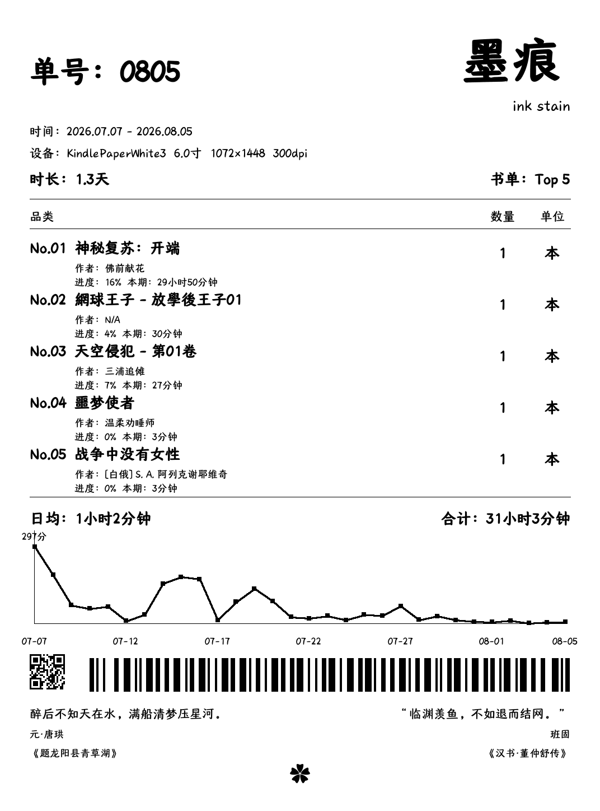
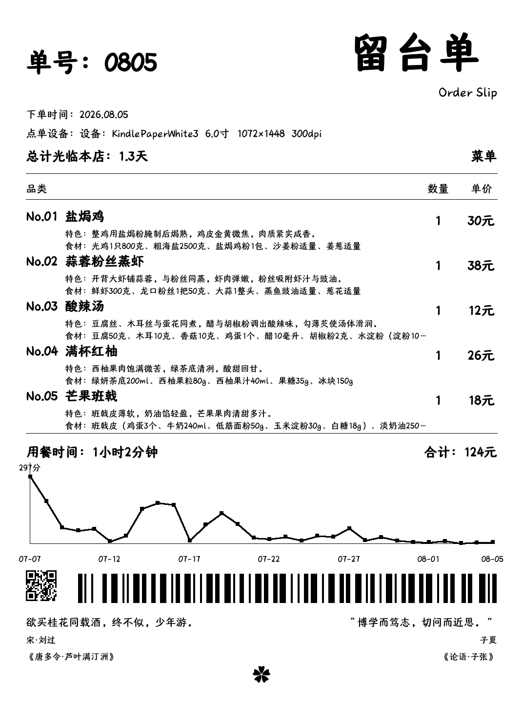

# 📖 KOReader 阅读小票 + 锁屏壁纸补丁

> 让 KOReader 的每次休眠或手势呼出，都变成一张精美的阅读小票 —— 三种风格，随心切换，数据全部来自你的真实阅读统计。

---

## ✨ 功能亮点

- 🎞️ **胶片票根**  
  仿电影票根风格，展示当前书籍封面、页码、阅读进度、全书/本章剩余时间、今日阅读时长，还可随机展示高亮摘录。

- 🖋️ **墨痕壁纸**  
  墨痕账单式统计卡片，显示指定周期（1/7/30天）的阅读总时长、日均时长、每日阅读趋势折线图，以及 Top 5 书籍的进度和阅读时间。底部附带经典诗词三行（诗句 / 朝代·作者 / 作品名），每次轮换。

- 📋 **菜单留台单**（v2.4.5 新增）  
  趣味餐厅留台单风格，随机生成 5 道菜品（主菜×2、汤菜×1、饮品×1、甜点×1），展示菜名、特色、食材、单价和总价。底部显示名人名言三行（名言 / 名人 / 出处）。

- 🔄 **三种样式自由切换**  
  支持固定、随机、轮流三种显示模式。轮流模式按“胶片 → 墨痕 → 菜单”顺序循环，每次打开都不一样。

- 🌸 **一键跳转阅读洞察**  
  所有小票底部均带小花图标（✿），点击后自动关闭并打开 **Reading Insights** 插件（需已安装），方便深度分析阅读数据。

- 💤 **锁屏即用**  
  可将任意样式设为休眠屏保，每次点亮屏幕都能看到不同的阅读小票。

- 📱 **全设备适配**  
  完美适配 Kindle、Kobo、PocketBook、Remarkable、Android 电纸书等设备，自动适应屏幕尺寸（大/小屏均优化）。

- 🔒 **纯离线 · 无隐私风险**  
  所有数据来自 KOReader 本地统计数据库（`statistics.sqlite3`），不写盘、无网络、无第三方依赖。

---

## 📸 预览

| 胶片票根 | 墨痕壁纸 | 菜单留台单 |
| :---: | :---: | :---: |
|  |  |  |

> **注意**：请将你的截图文件放到仓库的 `screenshots/` 文件夹，并分别命名为 `film.jpg`、`inkstain.jpg`、`menu.jpg`（或修改上方文件名以匹配你的实际图片）。

---

## 🚀 安装方法

1. **下载补丁文件**  
   将 `2-book-receipt-shortcut-and-lockscreen.lua` 下载到电脑。

2. **放置到 KOReader 补丁目录**  
   - 找到 KOReader 安装目录下的 `patches/` 文件夹（如果没有则手动创建）。  
   - 将 `.lua` 文件放入该目录，确保文件名以数字开头（如 `2-...`），以便按顺序加载。

3. **重启 KOReader**  
   完全退出 KOReader 后重新打开，补丁即生效。

4. **（可选）安装阅读洞察插件**  
   若想使用小花跳转功能，请从 KOReader 插件市场安装 `readinginsights.koplugin`。

---

## ⚙️ 使用方法

### 1. 启用锁屏小票
- 进入 **设置 → 屏保**，勾选 **“在休眠屏幕显示阅读摘要”**（`Show book receipt on sleep screen`）。  
- 设备休眠后，将自动显示你选中的小票样式。

### 2. 手势呼出小票（快捷查看）
- 在阅读界面，通过手势（QuickLook 分发动作）触发。  
- 你需要在 **设置 → 手势管理** 中为 `QuickLook` 动作分配一个手势（如双指点击）。  
- 执行该手势即可弹出小票弹窗，点击空白处或轻扫即可关闭。

### 3. 自定义设置（丰富选项）
在 **设置 → 屏保 → 阅读摘要设置** 中，你可以调整：

| 设置项 | 说明 |
|--------|------|
| **显示风格** | 固定选择“胶片票根 / 墨痕壁纸 / 菜单留台单”，或切换为“随机出现 / 轮流出现”。 |
| **内容模式**（仅胶片） | 默认“阅读摘要（默认）”；可切换为“高亮与进度”展示随机高亮摘录。 |
| **背景**（仅胶片） | 支持白色、透明、黑色、随机图片、书籍封面等多种背景。 |
| **封面缩放**（仅胶片） | 调整封面大小，设为 0 可隐藏封面。 |
| **休眠文字**（仅胶片） | 自定义休眠时显示的文字（如“正在充电”等）。 |
| **墨痕壁纸设置** | 统计周期（今天 / 7天 / 30天）和书单数量（Top 2~5）。 |

> 墨痕和菜单样式共用相同的周期和书单数量设置，改动后立即生效。

---

## 📊 数据来源

- **胶片票根**：基于当前打开书籍的阅读状态（页数、章节、阅读时间等）。  
- **墨痕 & 菜单**：基于 KOReader 自带的 **阅读统计**（`statistics.sqlite3`），统计你所有书籍的阅读记录。  
  - 若未启用“阅读统计”或数据库为空，墨痕/菜单会显示友好的提示信息。

---

## ❓ 常见问题

**Q：锁屏时不显示小票，而是默认屏保？**  
A：确认已在“屏保设置”中勾选“在休眠屏幕显示阅读摘要”。若仍无效，检查补丁是否被正确加载（可查看 `crash.log` 是否包含 `[BookReceipt]` 日志）。

**Q：墨痕/菜单没有数据，全是空白？**  
A：确保你已经阅读过书籍，且 KOReader 的“阅读统计”功能已启用（默认开启）。若数据库为空，补丁会显示提示文字。

**Q：点击小花图标无反应？**  
A：需要安装 `readinginsights.koplugin` 插件。请从 KOReader 插件市场下载或手动安装。

**Q：菜单样式里的菜谱/名言能自定义吗？**  
A：菜谱和名言已内嵌在补丁中，目前不支持外部文件替换。如有需要，可自行修改补丁中的 `RECIPE_TEXT` 和 `QUOTATION_TEXT` 常量。

**Q：补丁会影响性能或耗电吗？**  
A：不会。所有渲染在内存中完成，仅在显示时消耗少量 CPU，无后台任务，对日常阅读无任何影响。

---

## 📝 版本历史

详见补丁文件开头的 `-- 版本更新` 注释，当前最新版为 **v2.4.10**（诗词微调）。

---

## 🙏 致谢

本补丁整合了 [inkstain.koplugin](https://github.com/Estela-Zelin84/inkstain.koplugin)) 的墨痕壁纸引擎，并使用了其字体和二维码资源。感谢 KOReader 社区及原作者。

---

## 📄 许可证

本补丁采用 **MIT 许可证**，你可以自由使用、修改、分发。

---

**Happy Reading! 📖✨**
